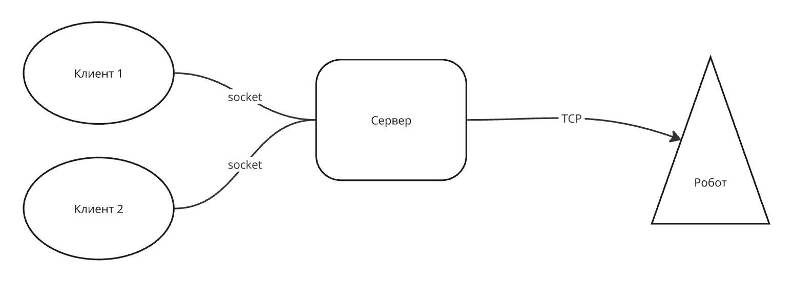

# ChessRobot316
В этом моно-репозитории будут лежать все компоненты проекта, реализующего возможность игры в шахматы с помощью робота-манипулятора.

## Что реализовано сейчас?
В подпроекте mobile_and_desktop, на данный момент, лежит клиент, реализованный с помощью кросс-платформенного фреймворка [Flutter](https://flutter.dev).
Он ходит напрямую в робота и отсылает ему команды от обоих игроков. Нас такой подход не устраивает, так как мы не можем поддержать игру с разных устройств. Также, не хочется
проверять, что будет, если попробовать подключиться к роботу сразу с двух устройств и вести шахматную партию параллельно. Спойлер - ничего хорошего не получится.

## Какой ожидаем результат?
В результате совместной работы в этом семестре хотим получить возможность играть в робота с 2х клиентов, в числе которых будет Web-версия, так как для игры в вебе 
пользователям не придется устанавливать приложение на свои устройства.

## Как это можно сделать?
Эту задачу можно решить множеством разных способов. Я опишу тезисно, как это вижу я, не привязываясь к конкретным языкам и фреймворкам - тут свобода выбора.

Реализовать эту архитектуру вам помогут следующие технологии:

- [Socket.io](https://socket.io) - пакеты для реализации сокетного соединения на любых платформах.
- [Redis](https://redis.io) - noSQL БДшка, которая поможет вам хранить данные об игровом поле.

Остальные технологии и пакеты выбирайте на свой вкус и цвет (кроме бэка на ноде, тк это не сработает).

Подобное поведение уже было реализовано мной в рамках другого курса в политехе, такчто, можете подглядывать в [проект](https://github.com/Ershov-Artem/tic_tac_toe_api).
